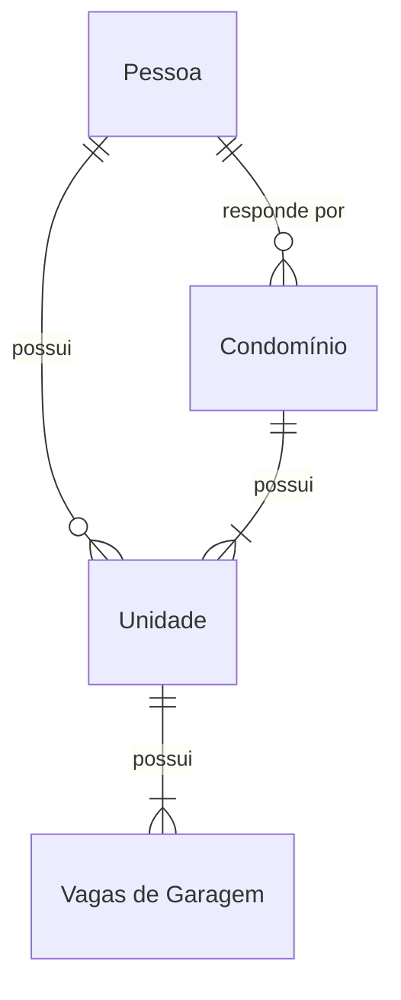

# parking-control
projeto de https://www.youtube.com/watch?v=LXRU-Z36GEU com melhorias da Marilia

## Melhorias
### 17/12/2023
#### Tenant
Cada cliente da aplicação terá seu estacionamento e conjunto específico de vagas.
- Criação da entidade, DTO e CRUD
### 23/12/2023
#### ResponsiblePerson
Pessoa responsável tanto pela vaga quanto pelo estacionamento, como o síndico que também é morador de um condomínio e tem direito a uma vaga.

O endereço de um condomínio, o CNPJ de um condomínio e o CPF de uma pessoa são valores únicos.
### 24/12/2023
#### TenantUnit
Unidade (apartamento) ao qual uma vaga de garagem deve ser associada

### 20/01/2024
#### Versão SpringBoot
Versão do SpringBoot atualizada para 3.2.2
#### Exceções
Propriedades de retorno de exceções a nível de aplicação